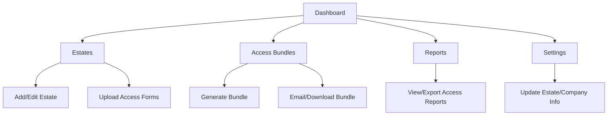

# AccessZen Tab & Workflow Overview

This document explains what each AccessZen tab does, how users interact with them, and how they fit into the overall workflow. Written in plain English for easy understanding.

---

## Tabs in AccessZen

### Dashboard
- **What it does:**
  - The main overview for AccessZen. Shows a summary of estate access activity, pending requests, and recent updates.
- **Main actions:**
  - See estate and access stats at a glance.
  - Navigate to other tabs.
  - View recent activity or notifications.
- **How it fits:**
  - The starting point for estate managers and admins to get a "big picture" view of access activity.

---

### Estates
- **What it does:**
  - Manage all estates (gated communities, buildings, etc.) and their access requirements.
- **Main actions:**
  - Add or edit estate details (name, address, access rules).
  - Upload or update access forms and templates.
  - View estate-specific access logs and requests.
- **How it fits:**
  - Central hub for managing which estates are available and their access requirements.

---

### Access Bundles
- **What it does:**
  - Generate, send, and track access bundles (PDFs, documents) for estate entry.
- **Main actions:**
  - Generate access bundles for employees or visitors.
  - Email or download access documents.
  - Track which bundles have been sent or used.
- **How it fits:**
  - Ensures everyone entering an estate has the correct documents and permissions.

---

### Reports
- **What it does:**
  - Generate and view reports on estate access, bundle usage, and compliance.
- **Main actions:**
  - View access logs and summary reports.
  - Export or print reports for record-keeping or sharing.
- **How it fits:**
  - Helps estate managers and companies track who accessed what, when, and ensure compliance.

---

### Settings
- **What it does:**
  - Configure estate-wide settings, notification preferences, and integrations.
- **Main actions:**
  - Update estate or company info.
  - Manage notification preferences.
  - Set up integrations (if any).
- **How it fits:**
  - Used for initial setup and ongoing configuration of AccessZen features.

---

## Typical AccessZen User Flow

1. **Set Up Estates:**
   - Estate manager adds new estates in the Estates tab, uploads access forms, and sets requirements.
2. **Generate Access Bundles:**
   - Admin or manager generates access bundles for employees or visitors in the Access Bundles tab.
3. **Distribute Bundles:**
   - Bundles are emailed or downloaded and given to those needing access.
4. **Track Access:**
   - Access logs and reports are reviewed in the Reports tab.
5. **Settings:**
   - Estate or company settings are updated as needed.

---

## Visual Flowchart

---

*Update this doc as your tabs or flows change!* 