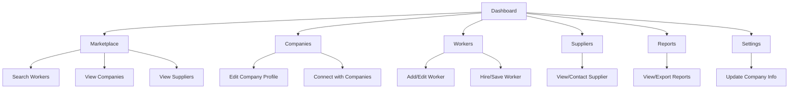

# ConnectZen Tab & Workflow Overview

This document explains what each ConnectZen tab does, how users interact with them, and how they fit into the overall workflow. Written in plain English for easy understanding.

---

## Tabs in ConnectZen

### Dashboard
- **What it does:**
  - The main overview for ConnectZen companies. Shows company info, stats, recent activity, and quick links to manage your business.
- **Main actions:**
  - See company stats and updates at a glance.
  - Navigate to other tabs.
  - View recent activity or notifications.
- **How it fits:**
  - The starting point for company admins to manage their business and see what's happening.

---

### Marketplace
- **What it does:**
  - Browse and search for workers, companies, and suppliers in the ConnectZen network.
- **Main actions:**
  - Search and filter workers by trade, location, or skills.
  - View company and supplier profiles.
  - Save or contact workers, companies, or suppliers.
- **How it fits:**
  - Central hub for finding talent, partners, or suppliers for your business needs.

---

### Companies
- **What it does:**
  - Manage your company profile and view other companies in the network.
- **Main actions:**
  - Edit your company profile (info, logo, description).
  - View and connect with other companies.
- **How it fits:**
  - Helps you keep your company info up to date and build business relationships.

---

### Workers
- **What it does:**
  - Manage your own workers or browse available workers in the marketplace.
- **Main actions:**
  - Add or edit worker profiles.
  - View worker details, ratings, and availability.
  - Hire or save workers for future projects.
- **How it fits:**
  - Makes it easy to build and manage your workforce.

---

### Suppliers
- **What it does:**
  - Browse and connect with suppliers for materials, tools, or services.
- **Main actions:**
  - View supplier profiles and offerings.
  - Contact or save suppliers for future needs.
- **How it fits:**
  - Helps companies find reliable suppliers and manage procurement.

---

### Reports
- **What it does:**
  - Generate and view reports on company activity, worker performance, and marketplace trends.
- **Main actions:**
  - View and export reports for record-keeping or analysis.
- **How it fits:**
  - Helps companies track performance and make informed decisions.

---

### Settings
- **What it does:**
  - Configure company-wide settings, notification preferences, and integrations.
- **Main actions:**
  - Update company info.
  - Manage notification preferences.
  - Set up integrations (if any).
- **How it fits:**
  - Used for initial setup and ongoing configuration of ConnectZen features.

---

## Typical ConnectZen User Flow

1. **Set Up Company Profile:**
   - Company admin creates or updates their company profile in the Companies tab.
2. **Browse Marketplace:**
   - Search for workers, companies, or suppliers in the Marketplace tab.
3. **Manage Workforce:**
   - Add, edit, or hire workers in the Workers tab.
4. **Connect with Suppliers:**
   - Find and contact suppliers in the Suppliers tab.
5. **Reporting:**
   - Review company and marketplace reports in the Reports tab.
6. **Settings:**
   - Update company settings as needed.

---

## Visual Flowchart

---

## Recent Updates (June 2025)

- **Marketplace Tabs:** The business marketplace now uses real-time data from Firestore for workers, companies, and suppliers. All mock data has been removed.
- **Trade Filtering:** The trade dropdown in the marketplace and workers tab uses the new `TradeSelect` component, which fetches trades from the database and is reusable across the app.
- **Public Profiles:** Workers now have a dedicated public profile page (`/connectzen/worker/[workerId]/publicProfile`) with a clean, read-only layout. Company and supplier public profiles are planned next. These pages use the same gallery, info, and contact components as the main app, but with editing and sensitive info hidden.
- **Reusable Components:** PortfolioGallery, DocumentsUploader, and TradeSelect are now used throughout ConnectZen for consistent UI and logic.
- **Navigation:** The dashboard button in the main nav is now role-aware, routing companies, workers, and (soon) suppliers to their correct dashboard or profile page.
- **Filtering & Search:** All search and filter dropdowns in the marketplace are now powered by real data and reusable components, ensuring up-to-date options and a consistent experience.

## July 2025 Updates

- Company dashboard now includes a portfolio gallery section with photo upload/take buttons, moved above the workers section.
- The 'View Profile' button on company cards in the business marketplace now navigates to the new public company profile page.
- Supplier flow implemented: supplier signup page, dashboard, portfolio gallery, document upload, and correct login/redirect logic.
- Supplier profile form is modular and located in /app/(modules)/connectzen/suppliers/.
- DocumentsUploader is now a shared component, not hidden in crewzen.
- All relevant fixes (logo upload bug, services optional, supplier profile lookup in auth-provider, etc.) are in place.
- See the file overview doc for a full mapping and refactor blueprint for all employee-related forms and logic.

---

*Update this doc as your tabs or flows change!* 