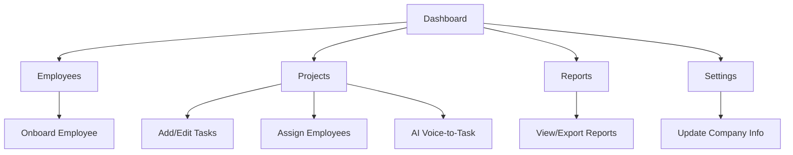

# CrewZen Tab & Workflow Overview

This document explains what each CrewZen tab does, how users interact with them, and how they fit into the overall workflow. Written in plain English for easy understanding.

---

## Tabs in CrewZen

### Dashboard
- **What it does:**
  - The main overview for CrewZen. Shows a summary of your company's activity: active projects, employee stats, recent updates, and quick links.
- **Main actions:**
  - See project and employee stats at a glance.
  - Navigate to other tabs.
  - View recent activity or notifications.
- **How it fits:**
  - The starting point for managers and admins to get a "big picture" view.

---

### Employees
- **What it does:**
  - Manage all your company's employees. Add, edit, onboard, or remove employees.
- **Main actions:**
  - Add a new employee (starts onboarding flow).
  - Edit employee details (name, contact, documents).
  - Upload profile photos, ID copies, and certificates.
  - Delete employees (with confirmation).
  - View employee profiles and status.
- **How it fits:**
  - Central hub for HR and onboarding. Ensures all employees are registered and have complete profiles.

---

### Projects
- **What it does:**
  - Manage construction projects. Track project status, assign employees, and manage tasks.
- **Main actions:**
  - Create new projects.
  - Add/edit/delete tasks (with photo upload).
  - Assign employees to projects.
  - Use AI voice-to-task to generate tasks from voice notes.
  - Track project progress and completion.
- **How it fits:**
  - The core of project management—where work is planned, tracked, and completed.

---

### Reports
- **What it does:**
  - Generate and view reports on projects, employees, and company activity.
- **Main actions:**
  - View attendance, progress, and summary reports.
  - Export or print reports for record-keeping.
- **How it fits:**
  - Helps managers and admins track performance, compliance, and progress.

---

### Settings
- **What it does:**
  - Configure company-wide settings, preferences, and integrations.
- **Main actions:**
  - Update company info.
  - Manage notification preferences.
  - Set up integrations (if any).
- **How it fits:**
  - Used for initial setup and ongoing configuration.

---

## Typical CrewZen User Flow

1. **Onboard Employees:**
   - HR/admin adds new employees in the Employees tab, uploads required documents, and completes onboarding.
2. **Set Up Projects:**
   - Manager creates new projects in the Projects tab, assigns employees, and adds tasks.
3. **Daily Management:**
   - Employees check in, update tasks, and upload progress photos.
4. **Reporting:**
   - Managers review reports in the Reports tab to track attendance, progress, and compliance.
5. **Settings:**
   - Company updates settings as needed.

---

## Visual Flowchart

---

*Update this doc as your tabs or flows change!* 