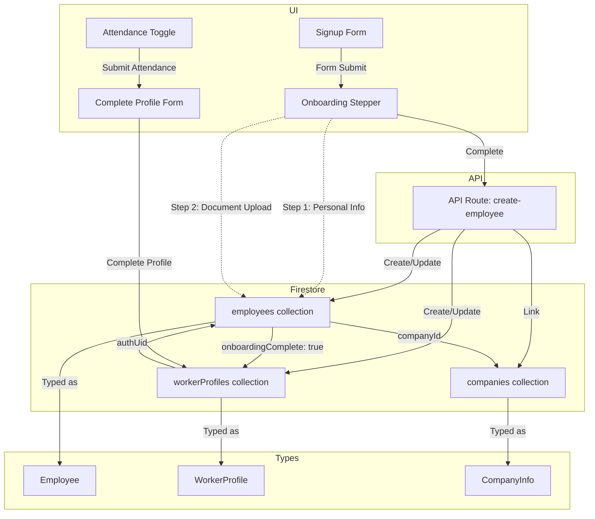
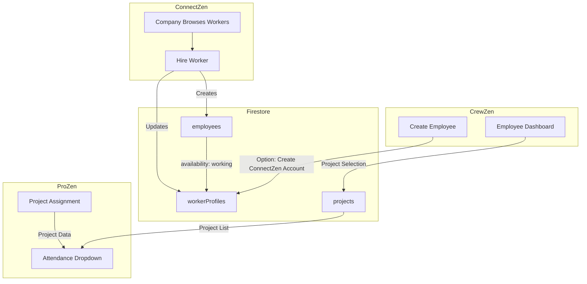

# Onboarding & Data Flow Diagram



---

**Legend:**
- **UI**: User interface components for signup, onboarding, attendance, and profile completion
- **API**: Backend routes handling creation and updates
- **Firestore**: Database collections
- **Types**: TypeScript data structures

**Flow:**
1. User is onboarded as an employee by the company (creates Employee record).
2. On first login, employee is shown the attendance toggle.
3. After submitting attendance, the system checks if their WorkerProfile (public profile) is complete.
4. If incomplete, the employee is redirected to a "Complete Your Profile" form to fill in public fields (availability, tradeTags, skills, yearsExperience, preferredRate, bio, location).
5. After completing their profile, the employee is redirected to the Business Marketplace.
6. Employee and WorkerProfile data are linked and typed according to your TypeScript models.
7. Onboarding completion is marked in Firestore, linking employees to companies and profiles.

> Update this diagram as your flows evolve!

# Two-Step Onboarding Process

1. **Company Onboarding:**
   - Company admin creates an employee (Employee record, company-only fields).
2. **Worker Self-Completion:**
   - On first login, employee completes their WorkerProfile (public/marketplace fields).
   - This ensures all workers have a complete public profile, even if they started as company employees.

# Module Communication Flow



---

# Sync Mechanisms Flow

```mermaid
flowchart TD
    subgraph Trigger
        A[Photo Upload]
        B[Profile Update]
        C[Onboarding Complete]
    end
    subgraph API
        D[/api/sync-profile-photos]
    end
    subgraph Firestore
        E[employees]
        F[workerProfiles]
    end

    A --> D
    B --> D
    C --> D
    D -->|Sync Photo URLs| E
    D -->|Sync Photo URLs| F
    E -->|Basic Info| F
    F -->|Basic Info| E
```

---

# Legend
- **Module Communication Flow:** Shows how ConnectZen, CrewZen, and ProZen modules interact via Firestore collections and UI actions.
- **Sync Mechanisms Flow:** Visualizes triggers and API endpoints that keep data (photos, basic info) consistent between collections.

> Update these diagrams as your flows and modules evolve!
