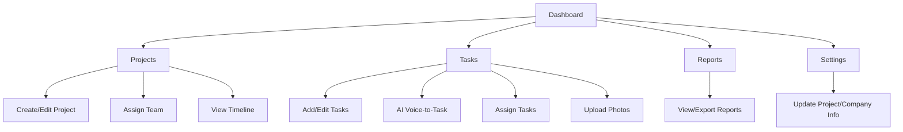

# ProZen Tab & Workflow Overview

This document explains what each ProZen tab does, how users interact with them, and how they fit into the overall workflow. Written in plain English for easy understanding.

---

## Tabs in ProZen

### Dashboard
- **What it does:**
  - The main overview for ProZen. Shows a summary of all active projects, key metrics, deadlines, and recent activity.
- **Main actions:**
  - See project stats and progress at a glance.
  - Navigate to other tabs.
  - View recent updates or notifications.
- **How it fits:**
  - The starting point for project managers to get a "big picture" view of all projects.

---

### Projects
- **What it does:**
  - Manage all construction projects. Create, edit, and track projects from start to finish.
- **Main actions:**
  - Create new projects.
  - Edit project details (name, address, status, team).
  - Assign team members and companies.
  - View project timelines and milestones.
- **How it fits:**
  - Central hub for project management. All project planning and tracking starts here.

---

### Tasks
- **What it does:**
  - Manage and track tasks within each project. Use AI to generate tasks from voice notes.
- **Main actions:**
  - Add/edit/delete tasks for a project.
  - Assign tasks to team members.
  - Upload photos or documents for tasks.
  - Use AI voice-to-task to quickly create tasks from voice notes.
  - Mark tasks as complete or in progress.
- **How it fits:**
  - Keeps work organized and ensures nothing falls through the cracks. Enables fast task creation and tracking.

---

### Reports
- **What it does:**
  - Generate and view reports on project progress, task completion, and team performance.
- **Main actions:**
  - View project and task reports.
  - Export or print reports for record-keeping or sharing.
- **How it fits:**
  - Helps managers and stakeholders track progress, spot issues, and ensure accountability.

---

### Settings
- **What it does:**
  - Configure project-wide settings, notifications, and integrations.
- **Main actions:**
  - Update project or company info.
  - Manage notification preferences.
  - Set up integrations (if any).
- **How it fits:**
  - Used for initial setup and ongoing configuration of ProZen features.

---

## Typical ProZen User Flow

1. **Set Up Projects:**
   - Project manager creates new projects in the Projects tab, adds details, and assigns team members.
2. **Add and Manage Tasks:**
   - Tasks are created (manually or via AI voice-to-task), assigned, and tracked in the Tasks tab.
3. **Daily Management:**
   - Team members update task status, upload progress photos, and mark work as complete.
4. **Reporting:**
   - Managers review reports in the Reports tab to track project and task progress.
5. **Settings:**
   - Company or project settings are updated as needed.

---

## Visual Flowchart

---

*Update this doc as your tabs or flows change!* 